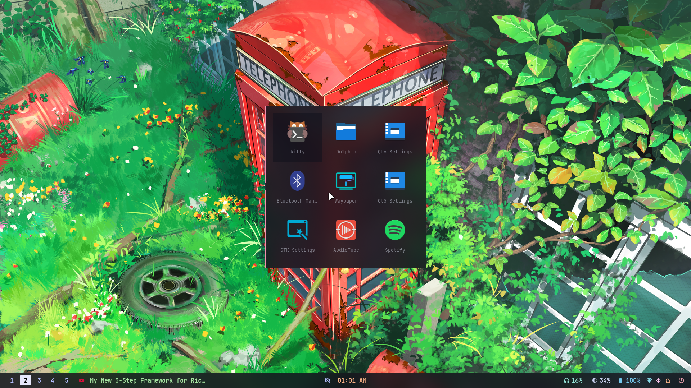
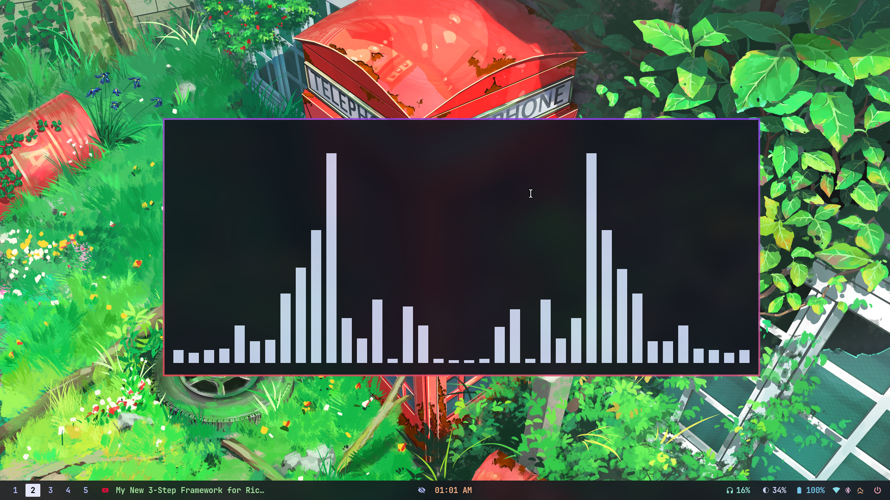
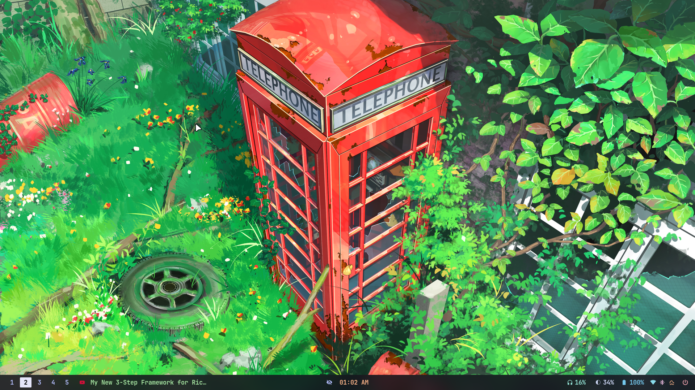
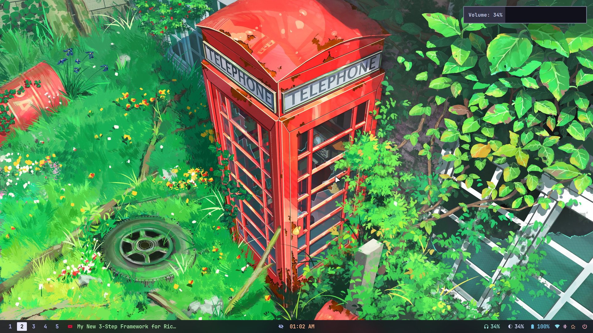
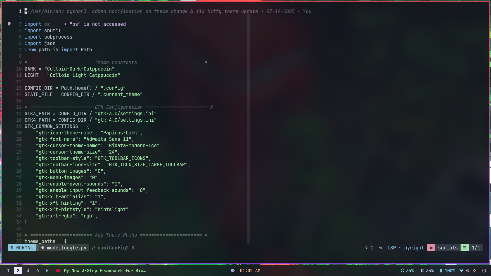

# 🌊 NamiConfig 2.0


<div align="center">


<h2>🚀 Modern, Modular & Polished Dotfiles for Arch + Hyprland</h2>

<p>
  <b>Unified theming</b> · <b>Consistent UI/UX</b> · <b>One-click 🌗 Light/Dark toggle</b> <br>
  <b>Powered by <a href="https://www.gnu.org/software/stow/">GNU Stow</a></b>
</p>

</div>

---

A modular dotfiles system built for **Arch Linux + Hyprland**, featuring unified theming, consistent UI/UX, and one-click light/dark toggle support. Managed cleanly using **[GNU Stow](https://www.gnu.org/software/stow/)**.

---

## 📦 Structure (Stow-compatible)

```

.
├── .config/
│ ├── bat/
│ ├── cava/
│ ├── hypr/
│ ├── kitty/
│ ├── Kvantum/
│ ├── mako/
│ ├── NamiThemes/
│ ├── qt5ct/
│ ├── qt6ct/
│ ├── rofi/
│ ├── scripts/
│ ├── spicetify/
│ ├── swappy/
│ ├── waybar/
│ └── zathura/
├── .zshrc
└── README.md

```

Each folder (e.g., `hypr`, `rofi`, `kitty`, etc.) is a Stow "package" you can symlink into your `$HOME` directory.

---

## 🧰 How to Use

### 🔹 Step 1: Clone this repo

```bash
git clone https://github.com/yourusername/NamiConfig.git ~/.dotfiles
cd ~/.dotfiles
```

### 🔹 Step 2: Install stow

```bash
sudo pacman -S stow     # or use your distro's package manager
```

### 🔹 Step 3: Stow desired modules

```bash
stow .config/kitty
stow .config/waybar
stow .zshrc
```

Or stow everything at once:

```bash
stow .
```

---

## 🎨 Theme Toggle Script

Switch between **light** and **dark** mode across all supported apps:

```bash
~/.config/hypr/scripts/wayBarThemeSwitch.py
```

### ✅ Applies to:

- GTK 3/4 (via gsettings + config)
- Kitty, Waybar, Mako, Rofi
- VSCode (edits `settings.json`)
- Nemo reload (only if running)
- Sends a themed desktop notification

---

## 🌈 Themes & Styles

Located under:

```
~/.config/NamiThemes/
```

Includes `light` and `dark` variants for:

- `kitty`
- `waybar`
- `mako`
- `rofi`

The toggle script will automatically pick the correct theme files and hot-reload supported apps.

---

## 🖼 Wallpapers

Wallpapers used with `hyprpaper` are in:

```
~/.config/hypr/wall/
```

---

## 📸 Screenshots

---

### 🌑 Dark Mode

|           Screenshot 1           |           Screenshot 2           |           Screenshot 3           |           Screenshot 4           |           Screenshot 5           |
| :------------------------------: | :------------------------------: | :------------------------------: | :------------------------------: | :------------------------------: |
|  |  |  |  |  |

---

## ⚙️ Requirements

Make sure you have:

- `hyprland`, `waybar`, `mako`, `kitty`, `rofi`, `nemo`
- `bat`, `cava`, `swappy`, `spicetify`
- `python3`, `stow`
- Nerd Fonts (e.g., `JetBrainsMono Nerd Font`)

---

## 🛠 To-Do

- [ ] Add `fzf`/`rofi` based theme switcher UI
- [ ] Add a wall+theme sync script
- [ ] VSCode extension auto-theming
- [ ] Optional CLI preview (like `nvfetcher`)

---

## 🙏 Credits

- [Catppuccin Theme](https://github.com/catppuccin)
- [adi1090x Rofi Scripts](https://github.com/adi1090x/rofi)
- [nwg-piotr Waybar Modules](https://github.com/nwg-piotr/waybar)

---

## 📜 License

MIT — use, fork, and modify freely.

```

---

Let me know if you want a `bootstrap.sh` script to automate the Stow linking process or theme preview screenshots added.
```
